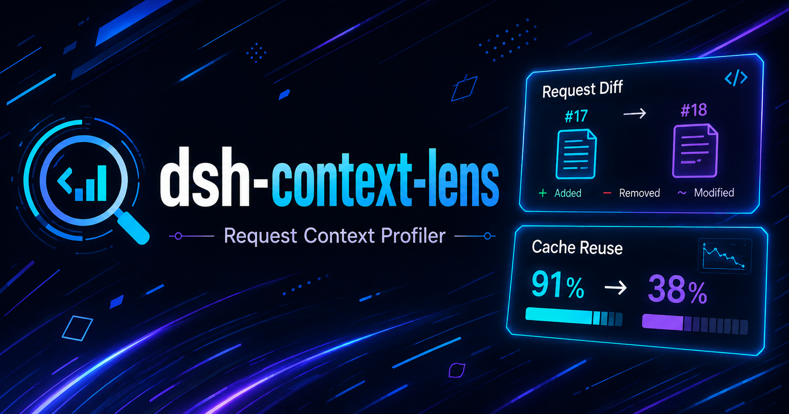

<p align="center">
  
</p>

# dsh-context-lens

Request Context Profiler for DeepSeek Harness — see what changed between model requests, and how cache reuse changed with it.

## What it is

`dsh-context-lens` is a DeepSeek Harness plugin (server unit + client view) that answers one question continuously: **"what did the harness send the model this time, and what changed since the last request?"** It is a pure observer — it reads the session log, adds nothing to it, and never touches a model call.

For every real LLM request it records one compact card:

- **Request identity** — turn:step, provider, model, context window, status (completed / failed / aborted).
- **The committed request context** — canonical fingerprints of the system prompt, the tool set (each tool's schema hash + estimated tokens), the request config, and the tool declaration order. Only state actually committed to a real model request is compared; the harness's mutable state is never observed.
- **Cache reuse readout** — computed strictly from the provider's disjoint usage buckets (uncached input + cache reads + cache writes = billed input). Missing fields stay absent (`unavailable`), never zero.
- **Diff vs the previous request** — model, provider, config, system prompt, tool set (+added/−removed/~modified), tool order, estimated surface delta, and the cache-reuse boundary in percentage points.
- **Drop alarm** — when reuse dropped across the threshold, a ranked list of coincident changes (correlation, never causation) with an explicit disclaimer.

The view (a `conversation.view` slot, zh/en) shows an overview strip, the recent-requests list (newest last, up to 100 retained), and a per-request inspector with the drop banner.

## Accuracy boundaries

Everything on the left is genuinely observable; nothing on the right is ever claimed.

| Can determine | Cannot determine (and never claims) |
| --- | --- |
| System prompt, tool set, tool schemas, declaration order, request config — as committed to the request | The provider's internal cache key construction |
| Model and provider of each request | The exact token at which prefix reuse breaks (KV-causality) |
| Provider-reported usage buckets (uncached input / cache reads / cache writes / output / reasoning) | Which single change caused a drop — only correlation |
| Reuse ratio and its delta between consecutive requests | Cache state of sessions/requests that left the 100-entry window |
| A heuristic surface estimate (chars/4 + per-block + per-role overhead) | Anything about the harness's in-memory state |

## Architecture

**Server** — one pure, replayable projection (`contextLens`) folds the session log: `request/header` events (epoch-logged, committed only on change) define the snapshot in force at each `step/start`; a header landing inside the step replaces it (that is the header the provider actually saw). Finalization happens at `turn/end` (or at the next `step/start` for crash-orphaned logs). Retries never mint new records. Uninteresting events return the same state reference — the registry's zero-work `Object.is` gate.

**Replay consistency is a tested invariant**: folding the log incrementally (live) and folding the same log from `init` (replay) produce identical state and projection.

**Client** — registers the `context-lens` entry (order 30) in the `conversation.view` slot, reads the projection through the framework's `useProjection('contextLens')` seat, and ships its own zh/en locale namespace. Selection is component-local. No heavy UI dependencies; CSS Modules compiled with lightningcss and injected as one idempotent `<style>` tag.

**Zero overhead** — no new session events, no model tools, no prompt injection, no KV simulation. A no-op companion plugin (`context-lens-invariant`) exists solely to reserve the package name under the harness's invariants service.

## Install & build

The published npm snapshot of the harness packages is incomplete: `@deepseek-ai/dsh-compact` and `@deepseek-ai/dsh-type-meta` are referenced by peers/dependencies but have never been published, and pnpm ≥ 10/11 auto-installs peers — so a plain registry install fails. This repo vendors type-only copies of the eight `@deepseek-ai/dsh-*` packages under `vendor-stubs/` (dev-time, `lib/types` snapshots with sanitized `package.json`; only `dsh-llm` carries a 3-line runtime for its brand constructors). `@deepseek-ai/cordis` installs for real. See `IMPLEMENTATION_NOTES.md` → "npm snapshot gaps" for the full story.

```sh
pnpm install
pnpm typecheck   # tsc --noEmit
pnpm test        # vitest — 53 tests: fingerprint, cache math, diffing, projection lifecycle, replay consistency, determinism
pnpm build       # tsc declarations → lib/types, tsdown → lib/index.js + lib/invariant.js + lib/client.js (browser, closure-factory ABI)
```

The browser bundle replicates the harness client-bundle ABI: `window.__ModuleLoader__.load({ id: "dsh-context-lens", factory: (require) => … })`, resolving `react` / `react-dom` / platform module-table entries through the loader-injected require and inlining everything else.

## Layout

```
src/                 server: types, fingerprint, cache, diff, projection, index; companion invariant
src/client/          the conversation view + locales + CSS Modules
tests/               vitest specs incl. the replay-consistency suite
vendor-stubs/        type-only vendored snapshots of the @deepseek-ai/dsh-* packages
cordis.patch.yml     dsh bundle patch metadata
```

## v0.2 ideas

- Retained-window cursor to inspect older requests than 100.
- Optional per-request raw header inspector (committed JSON, collapsible).
- Correlation drill-down: group drops by (model, provider, tool-set hash) across the window.

## License

MIT
